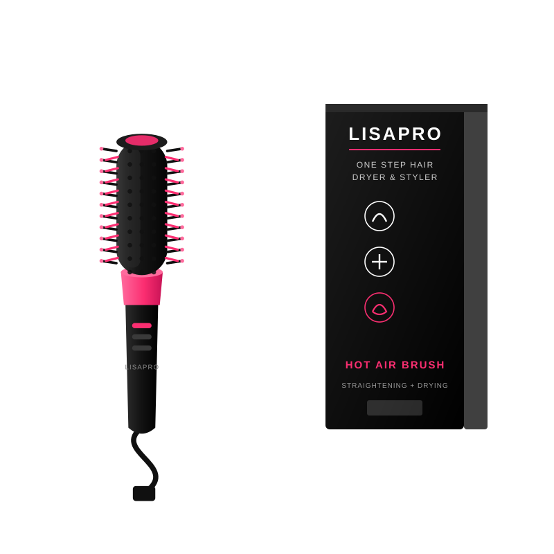

# Butterfly — Cepillo, Secador y Aplanchador 3 en 1

Tienda de un solo producto, lista para vender. Funciona en cualquier hosting
(incluso gratis), no necesita servidor, base de datos ni instalar nada.

- **Pedidos llegan a tu WhatsApp:** `0960702682`
- **Formas de pago:** pago contra entrega y transferencia (5 % de descuento)
- **Optimizada para celular** — que es donde compra más del 80 % de la gente

---

## 1. Probarla ahora mismo

Abre una terminal en esta carpeta y ejecuta:

```bash
python3 -m http.server 8000
```

Luego entra a `http://localhost:8000` en tu navegador.

> No abras el `index.html` con doble clic: los navegadores bloquean el
> almacenamiento del carrito en archivos locales (`file://`). Siempre usa un
> servidor, aunque sea el de la línea de arriba.

---

## 2. Lo que ya está funcionando

| Función | Estado |
|---|---|
| Galería de 5 imágenes con deslizar, flechas, puntos y miniaturas | ✅ |
| Packs de 1, 2 y 3 unidades con precio por unidad | ✅ |
| Carrito con sumar/restar/eliminar, guardado en el navegador | ✅ |
| Cajón lateral del carrito | ✅ |
| Barra fija inferior "Añadir al carrito" | ✅ |
| Cuenta regresiva de la oferta | ✅ |
| Aviso de stock bajo | ✅ |
| 6 preguntas frecuentes en acordeón | ✅ |
| 12 reseñas con foto, estrellas y sello de verificada | ✅ |
| Carrusel de clientas felices | ✅ |
| Estadísticas con anillos animados | ✅ |
| Checkout con validación de cédula/RUC y celular ecuatorianos | ✅ |
| Pago contra entrega sin recargo | ✅ |
| Transferencia con 5 % de descuento y datos bancarios | ✅ |
| Pedido formateado y enviado a tu WhatsApp | ✅ |
| Página de confirmación con número de pedido e impresión | ✅ |
| Envío gratis y tiempos por provincia | ✅ |
| Datos para Google (producto, estrellas, precio, FAQ) | ✅ |

**172 pruebas automatizadas pasando.** Para volver a correrlas:

```bash
bash herramientas/probar.sh
```

---

## 3. Tus datos, ya configurados

Todo está en `assets/js/config.js`, listo:

```js
tienda: {
  nombre: 'Butterfly',
  email: 'corpusenigma4@gmail.com',
  dominio: 'https://butterfly.store',
}

whatsapp: {
  numeroLocal: '0960702682',
  numeroWa: '593960702682',
}

// Cuenta para recibir transferencias
cuentas: [
  {
    banco: 'Banco Pichincha',
    tipo: 'Cuenta de Ahorros',
    numero: '2213135141',
    titular: 'Andrey Cabascango',
    identificacion: '',   // opcional: si lo llenas, se muestra
    correo: 'corpusenigma4@gmail.com',
  },
],
```

### Agregar una segunda cuenta

Copia el bloque `{ ... }` y sepáralo con coma. La tienda muestra todas las
cuentas automáticamente, cada una con su botón de copiar:

```js
cuentas: [
  { banco: 'Banco Pichincha', tipo: 'Cuenta de Ahorros', numero: '2213135141',
    titular: 'Andrey Cabascango', identificacion: '', correo: 'corpusenigma4@gmail.com' },
  { banco: 'Banco Guayaquil', tipo: 'Cuenta Corriente', numero: '...',
    titular: 'Andrey Cabascango', identificacion: '', correo: 'corpusenigma4@gmail.com' },
],
```

### Lo único que falta: las fotos reales

Ver la sección 4.

---

## 4. Cambiar las imágenes por tus fotos reales

La tienda viene con **ilustraciones vectoriales** para que funcione desde el
primer segundo. Se ven bien, pero **nada vende como una foto real**.

### Fotos del producto

Pon tus fotos en `assets/img/` y actualiza la galería en `config.js`:

```js
galeria: [
  { src: 'assets/img/producto-1.jpg', alt: 'Cepillo con su caja' },
  { src: 'assets/img/producto-2.jpg', alt: 'Medidas del cepillo' },
  // ...agrega o quita las que quieras
],
imagenPrincipal: 'assets/img/producto-1.jpg',
```

También cambia estas dos líneas en `index.html` si usas otra extensión:

```html
<link rel="preload" href="assets/img/producto-1.svg" as="image">

```

**Recomendaciones para las fotos:**
- Cuadradas (1:1), mínimo 1000×1000 px
- Formato `.webp` si puedes (pesa la mitad que `.jpg`)
- Fondo blanco o muy claro
- Menos de 200 KB cada una

### Fotos de las reseñas

Edita `assets/js/contenido.js`:

```js
{
  autora: 'Lucía',
  estrellas: 5,
  foto: 'assets/img/resena-1.jpg',   // ← tu foto real
  texto: 'Llegó rapidísimo y funciona igual que en los videos.',
},
```

Puedes dejar `foto: ''` para una reseña de solo texto.

> **Importante:** las reseñas que vienen son de ejemplo. Reemplázalas por
> opiniones reales de tus clientas. Además de ser lo correcto, las reseñas
> reales convierten mucho mejor que las inventadas.

### Carrusel de clientas felices

Reemplaza `assets/img/clienta-1.svg` … `clienta-7.svg`. Si cambias la
extensión, ajusta la función `pintarFelices()` en `assets/js/landing.js`.

---

## 5. Cambiar precios y ofertas

Todo en `assets/js/config.js`:

```js
producto: {
  precio: 29.99,        // el precio que se cobra
  precioAntes: 50.00,   // el precio tachado (el % se calcula solo)
  stock: 6,             // el "Solo quedan X en stock"
  rating: 4.9,
  numResenas: 1084,
}
```

Los packs:

```js
packs: [
  { id: 'pack-1', cantidad: 1, titulo: '1 Cepillo', precio: 29.99, ... },
  { id: 'pack-2', cantidad: 2, titulo: '2 Cepillos', precio: 49.99,
    etiqueta: 'MÁS VENDIDO', destacado: true },
  { id: 'pack-3', cantidad: 3, titulo: '3 Cepillos', precio: 69.99, ... },
]
```

El descuento por transferencia:

```js
transferencia: {
  descuento: 0.05,   // 0.05 = 5 %. Pon 0 para quitarlo
}
```

El costo de envío:

```js
envio: {
  costo: 0,   // 0 = envío gratis. Pon 3.5 para cobrar $3.50
}
```

La duración de la cuenta regresiva:

```js
oferta: {
  activa: true,
  duracionMinutos: 20,   // pon activa: false para quitarla
}
```

---

## 6. Cómo llegan los pedidos

1. La clienta llena sus datos y elige cómo pagar.
2. Al tocar **Confirmar pedido** se abre WhatsApp con el pedido ya escrito.
3. Le llega a tu `0960702682` un mensaje así:

```
*NUEVO PEDIDO LP-260805-4821*
_Tienda Butterfly_

*PRODUCTOS*
• 1 x Cepillo, Secador y Aplanchador 3 en 1 (Pack de 2 unidades) — $49.99

*TOTALES*
Subtotal: $49.99
Descuento transferencia (5%): -$2.50
Envío: GRATIS
*TOTAL: $47.49 USD*

*FORMA DE PAGO*
Transferencia o depósito
(Enviaré el comprobante por aquí)

*DATOS DE ENTREGA*
Nombre: María José González Pérez
Cédula/RUC: 0926687856
Celular: 0991234567
Correo: maria@correo.com
Provincia: Guayas
Ciudad: Guayaquil
Dirección: Av. Francisco de Orellana 123 y Calle Segunda, Alborada etapa 5
Referencia: Casa esquinera de reja blanca, frente a la farmacia

*NOTAS*
Entregar en la tarde por favor

Entrega estimada: 24 a 48 horas
```

4. La clienta queda en la página de confirmación con su número de pedido, los
   datos bancarios (si eligió transferencia) y un botón para reenviarte el
   mensaje si la ventana de WhatsApp no se abrió.

También se guarda un historial de los últimos 20 pedidos en el navegador de la
clienta, por si necesita consultar su número.

### Cambiar el número de WhatsApp

En `assets/js/config.js`:

```js
whatsapp: {
  numeroLocal: '0960702682',      // como se marca en Ecuador
  numeroWa: '593960702682',       // internacional, sin + ni el 0 inicial
  numeroBonito: '+593 96 070 2682',
}
```

La regla para Ecuador: quita el `0` del inicio y pon `593` delante.
`0987654321` → `593987654321`.

---

## 7. Subirla a internet (gratis)

### Opción A — Netlify (la más fácil, 2 minutos)

1. Entra a [app.netlify.com/drop](https://app.netlify.com/drop)
2. Arrastra la carpeta del proyecto completa a la página
3. Listo, te da un enlace público al instante

Para conectar tu propio dominio: *Site settings → Domain management*.

### Opción B — Vercel

1. Instala: `npm i -g vercel`
2. En esta carpeta: `vercel`
3. Sigue las preguntas (acepta todo por defecto)

### Opción C — GitHub Pages

1. Sube la carpeta a un repositorio de GitHub
2. *Settings → Pages → Source: main / root*
3. Queda en `https://tuusuario.github.io/turepo`

### Opción D — Tu propio hosting

Sube todo por FTP a la carpeta `public_html`. Al ser HTML puro, funciona en
cualquier hosting, incluso el más básico.

> **Usa siempre HTTPS.** El botón "Copiar número de cuenta" necesita conexión
> segura para funcionar en todos los navegadores. Netlify, Vercel y GitHub
> Pages ya te dan HTTPS gratis.

---

## 8. Estructura de archivos

```
butterfty.store/
├── index.html              La página del producto
├── checkout.html           Datos del cliente y forma de pago
├── gracias.html            Confirmación del pedido
├── manifest.webmanifest    Para instalarla como app en el celular
├── README.md               Este archivo
│
├── assets/
│   ├── css/
│   │   └── styles.css      Todos los estilos
│   ├── js/
│   │   ├── config.js       ⭐ AQUÍ CAMBIAS PRECIOS, BANCO Y WHATSAPP
│   │   ├── contenido.js    ⭐ AQUÍ CAMBIAS RESEÑAS Y PREGUNTAS
│   │   ├── tienda.js       Carrito, iconos y utilidades
│   │   ├── landing.js      Lógica de la página del producto
│   │   ├── checkout.js     Validaciones y formas de pago
│   │   └── gracias.js      Página de confirmación
│   └── img/                29 imágenes (176 KB en total)
│
└── herramientas/
    ├── generar-imagenes.py Regenera las ilustraciones
    ├── probar.sh           Corre las 172 pruebas
    └── pruebas/            Las pruebas automatizadas
```

---

## 9. Detalles técnicos

**Cero dependencias.** No hay React, ni jQuery, ni nada que instalar o
actualizar. Solo HTML, CSS y JavaScript. Esto significa que la tienda va a
seguir funcionando igual en cinco años.

**Peso total: unos 250 KB**, imágenes incluidas. Carga casi instantánea incluso
con datos móviles lentos.

**Optimizaciones para celular:**
- Diseño pensado primero para pantallas de 360 px y hacia arriba
- Campos de formulario con letra de 16 px, para que iOS no haga zoom solo
- Áreas para tocar de 44 px mínimo
- Respeta el `safe-area` del iPhone (la barra inferior y el notch)
- Imágenes con carga diferida y medidas declaradas (no salta el contenido)
- Respeta "reducir movimiento" si la clienta lo tiene activado en su teléfono

**Validaciones reales:**
- Cédula ecuatoriana con el algoritmo del Registro Civil (módulo 10)
- RUC de persona natural y de sociedad
- Celular con formato `09XXXXXXXX`
- Todo el contenido se escapa antes de mostrarse, no hay riesgo de inyección

**Compatibilidad:** Chrome, Safari, Firefox y Edge, versiones de los últimos
3 años. Incluye Safari de iPhone y Chrome de Android.

**Accesibilidad:** navegable con teclado, etiquetas en todos los campos,
`aria` en acordeones y carrito, textos alternativos en las imágenes.

---

## 10. Preguntas que te van a surgir

**¿Los pedidos se guardan en algún lado?**
Llegan a tu WhatsApp, que es tu registro. En el navegador de la clienta queda
una copia de sus últimos pedidos. Si más adelante quieres una base de datos o
un panel de administración, se puede agregar.

**¿Puedo vender más productos?**
Esta tienda está diseñada para un producto (así convierte más). Para varios
productos hay que agregar un catálogo; el carrito ya está preparado para
manejar varios artículos distintos.

**¿Por qué no acepta tarjeta de crédito?**
Porque pediste solo contra entrega y transferencia. Si después quieres tarjeta,
se integra con Payphone, Datafast o Kushki (necesitas cuenta con ellos).

**¿Cómo cambio los colores?**
En `assets/css/styles.css`, las primeras líneas:

```css
:root {
  --rosa: #fb2e71;        /* el color principal */
  --rosa-oscuro: #e01f5f;
  --rosa-claro: #ff6b9d;
  --rosa-fondo: #fff2f6;
}
```

**¿Cómo cambio el nombre de la tienda?**
Busca `BUTTER<span>FLY</span>` en los tres archivos `.html` y cámbialo. También
el campo `tienda.nombre` en `config.js` y el `<title>` de cada página.

**¿Por qué el producto dice LISAPRO y la tienda Butterfly?**
Porque son dos cosas distintas: **Butterfly** es tu tienda y **LISAPRO** es la
marca impresa en el cepillo y en su caja. Así lo verá la clienta cuando le
llegue el paquete, y por eso las imágenes del producto conservan ese nombre. Si
algún día vendes el cepillo con tu propia marca, reemplaza las imágenes de
`assets/img/producto-*.svg` por tus fotos y listo.

**¿La cuenta regresiva es real?**
Se reinicia para cada visitante nuevo y dura los minutos que configures. Es una
técnica común de urgencia. Si prefieres no usarla, pon `activa: false`.

---

## 11. Antes de publicar: lista de verificación

- [x] Datos bancarios reales en `config.js` (Pichincha 2213135141)
- [x] WhatsApp `0960702682` conectado
- [x] Correo de contacto `corpusenigma4@gmail.com`
- [ ] Reemplacé las fotos del producto por las reales
- [ ] Reemplacé las reseñas por opiniones reales de clientas
- [ ] Revisé que el precio y los packs estén bien
- [ ] Confirmé los tiempos de entrega de mi transportadora
- [ ] Hice un pedido de prueba y me llegó el WhatsApp
- [ ] Abrí la tienda en mi propio celular y navegué toda la página
- [ ] Está publicada con HTTPS
